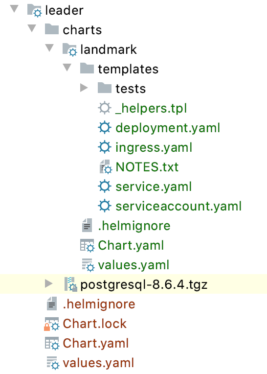

= Leader chart approach with Helm Charts in Openshift

* <<preparation, Preparation>>
** <<working-locally-with-the-docker-image-for-landmark-microservice,Working locally with the Docker image for Landmark Microservice>>
* <<leader-helm-chart-setup,  Leader Helm chart setup>>
** <<modify-values-yaml-file, Modify values.yaml file>>
*** <<add-the-posgresql-details, Add the PosgreSQL details>>
** <<modify-chart-yaml, Modify Chart.yaml>>
* <<local-helm-chart-setup, Local Helm chart setup>>
** <<edit-values-yaml, Edit values.yaml>>
* <<work-with-your-modified-charts, Work with your modified charts>>
* <<solution-and-more, Solution and more>>
* <<compatibility,Compatibility>>
* <<license,License>>

Assuming that you already went through the https://github.com/ammbra/landmark/tree/solution/chart-per-service-lab[chart per service approach],
you should use leader chart approach with Helm charts for many microservices when you want:

• to avoid unnecessary duplication
• to have consistency accross changes
• to introduce global changes in an easy manner.

You should be aware that this approach depends on the amount of charts for each lead chart and can introduce:

• high complexity of templates
• tight coupling
• less flexible local changes.

**Goal of this section: deploy the landmark microservice together with its database using Helm charts.
**

All the below commands will be executed in a terminal window.

=== Preparation
To login to the OpenShift cluster from the Terminal run:

[source, bash, subs="normal,attributes"]
----
$ oc login -u kubeadmin -p YOUR_SECRET_PASSWORD https://api.crc.testing:6443
----
Check if you already have the _dev_ project:
----
$ oc get project
$ oc new-project dev
----

The landmark microservice will persist its data into a database, in this case a PostgreSQL database instance.

Check if the Helm repo https://charts.bitnami.com/bitnami[https://charts.bitnami.com/bitnami] is added to your existing list:
[source, bash, subs="normal,attributes"]
----
$ helm repo list
----
If the repo is not there, please run the following set of commands:
[source, bash, subs="normal,attributes"]
----
$ helm repo add bitnami https://charts.bitnami.com/bitnami
----

==== Working locally with the Docker image for Landmark Microservice
Clone the repository https://github.com/ammbra/landmark[https://github.com/ammbra/landmark].

[source, bash, subs="normal,attributes"]
----
$ git clone https://github.com/ammbra/landmark.git
$ git checkout -b feature/leader-chart-lab
$ git pull
----

Try to build the project locally using https://github.com/ammbra/landmark/Run-Landmark-Microservice.adoc[Run-Landmark-Microservice.adoc].

Make sure that you are under root folder of the clone repository (_landmark_) and run:
[source, bash, subs="normal,attributes"]
----
$ mvn package
----
Then, build the image with:
[source, bash, subs="normal,attributes"]
----
$ docker run -d -p 5000:5000 --restart=always --name registry registry:2
$ docker build -f src/main/docker/Dockerfile.jvm -t quarkus/landmark:1.0 .
$ docker tag quarkus/landmark:1.0 localhost:5000/quarkus/landmark:1.0
$ docker push localhost:5000/quarkus/landmark:1.0
----

=== Leader Helm chart setup

Make sure that you are under root folder of the clone repository (_landmark_) and run:
[source, bash, subs="normal,attributes"]
----
$ helm create leader
$ tree leader
leader
├── Chart.yaml
├── templates
│   ├── NOTES.txt
│   ├── _helpers.tpl
│   ├── deployment.yaml
│   ├── ingress.yaml
│   ├── service.yaml
│   ├── serviceaccount.yaml
│   └── tests
│       └── test-connection.yaml
└── values.yaml
$ cd charts
----

Remove the templates folder under leader because in this approach we will not use it.

==== Modify *_values.yaml_* file
Go to the newly created charts and find the *values.yaml* file.
You can use vim or your favorite IDE to edit its values.
[source, bash, subs="normal,attributes"]
----
$ cd leader
$ vim values.yaml
----
====== Add the PostgreSQL credentials
Modify the name of the values file with the image values with:
[source, yaml, subs="normal,attributes"]
----
# Enabling postgres service, by default
postgresql:
  # Comment line below if db is deployed inside Kube
  postgresqlDatabase: landmark
  postgresqlUsername: postgres
  postgresqlPassword: postgres
  secretName: leader-postgresql
  server: leader-postgresql
  persistence:
    enabled: false
----

Save your work.

====== Modify _Chart.yaml_
Because we will deploy both charts (landmark and database), the _Chart.yaml_ file
needs to be modified and database dependency is specified there.

Go to _Chart.yaml_ and add a new section regarding dependencies.

[source, yaml, subs="normal,attributes"]
----
# These is the dependencies needed by the leader chart.
# Each time you need a new dependency, add it in this area
dependencies:
  - name: postgresql
    version: 8.6.4
    repository: "https://charts.bitnami.com/bitnami"
----

Save your work and run in the terminal the following command in order to update dependencies:
[source, bash, subs="normal,attributes"]
----
$ helm dependency update
----

=== Local Helm chart setup
If you went through chart per service setup you will reuse the chart created there.
If not, please download the https://github.com/ammbra/landmark/tree/solution/chart-per-service-lab[https://github.com/ammbra/landmark/tree/solution/chart-per-service-lab] or
use _wget_ to get just the chart folder.

Copy the content of landmark chart from https://github.com/ammbra/landmark/tree/solution/chart-per-service-lab/chart/landmark to your *_leader/charts_* folder.
The result should look like this:

===== Edit _values.yaml_

Got to *_leader/charts/landmark/values.yaml_* and comment the details regarding PostgreSQL:

[source, yaml, subs="normal,attributes"]
----
postgresql:
#  server: landmark-db-postgresql
#  secretName: landmark-db-postgresql
  secretKey:  postgresql-password
----
Also modify the value of NodePort to 31127.

[source, yaml, subs="normal,attributes"]
----
service:
  ports:
    port: 8080
    nodePort: 31127
  type: NodePort
----

=== Work with your modified charts
Install your charts in your current project:

[source, bash, subs="normal,attributes"]
----
$ helm install leader ./leader
$ helm status leader
$ kubectl get ns
$ kubectl get svc
$ kubectl port-forward --namespace dev svc/leader-landmark 8080
----

Go in a browser window and copy-paste http://localhost:8080/api/museum/ams

*Congratulations*, you found a landmark!

=== Solution and more
Blocked? Checkout the solution branch : https://github.com/ammbra/landmark/tree/solution/leader-chart-lab

Looking to validate your charts? Checkout the validation branch: https://github.com/ammbra/landmark/tree/validation/leader-chart-lab

|===
|https://github.com/ammbra/helm-openshift-workshop[Navigate to global instructions] | https://github.com/ammbra/landmark[Navigate to previous section] | https://github.com/ammbra/visitor[Navigate to next section]
|===

'''
=== Compatibility

The Java code in the repositories is compatible with Java11.

'''
=== License

This code is dedicated to the public domain to the maximum extent permitted by applicable law, pursuant to http://creativecommons.org/publicdomain/zero/1.0/[CC0].
